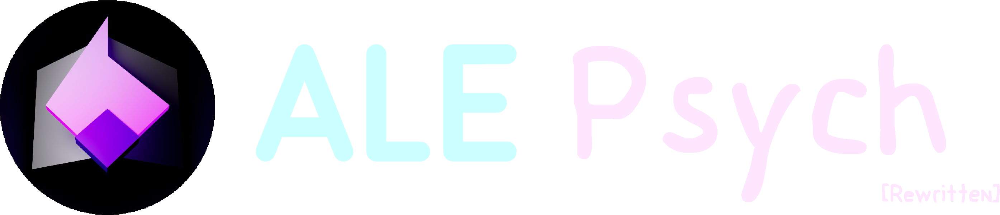

<h1 align="center">
  
</h1>

<h3 align="center"><em><strong>"If Psych was so good, why wasn’t there a Psych 2?"</strong></em></h3>

    
    
    
    

---

## Downloads

### Latest Builds

---

## Table of Contents
- [Downloads](#downloads)
- [Overview](#overview)
- [Key Differences from Psych](#key-differences-from-psych)
- [Current Limitations](#current-limitations)
- [Contributing](#contributing)
- [Community](#community)
- [Community Scripts and Tools](#community-scripts-and-tools)
- [Credits](#credits)
- [License](#license)

### Build Notes

- **Tagged releases are not yet available.**  
- For a more stable experience, consider waiting for official releases.  
- For testing and development, use the nightly builds provided above.

### Additional Resources

- [Getting Started Guide](https://github.com/ALE-Psych-Crew/ALE-Psych/wiki) – Installation and setup instructions  
- [Lua API Documentation](https://github.com/ALE-Psych-Crew/ALE-Psych/blob/main/docs/lua/Home.md) – In-depth scripting reference

### Quick Tip for Players

To open the Mods menu in-game, press **Ctrl + Shift + M**.

---

## Overview

**ALE Psych** is a fork of **Psych Engine 0.7.3**, created to replace **ALE Engine**, fix long-standing issues, and add new features.

The goal is simple: give developers the tools to build complete mods **without touching the source code**, while keeping the comfort and flexibility that Psych Engine provided.

---

## Key Differences from Psych

- Scripted **menus and submenus** (Lua and HScript).  
- Support for **custom classes**.  
- Support for **3D objects**.  
- Configurable **data.json** for engine/game properties.  
- JSON-based **options and credits**.  
- Integration with **RuleScript** for advanced HScript features.  
- Reorganized source structure, especially Lua.  
- Memory cleanup on menu changes.  
- Redesigned song loading (charts, scripts, audio).  
- `CoolUtil.save` replaces `FlxG.save` to avoid conflicts between mods.  
- Access the **Game Console** with `F2`.  

---

## Current Limitations

  
Click to expand

- Certain HScript/Lua functions are missing.  

---

## Contributing

We welcome contributions:

- Report issues and request features via [Issues](https://github.com/ALE-Psych-Crew/ALE-Psych/issues).  
- Submit pull requests following the existing coding style.  
- Test changes on at least one desktop platform.  
- Document new features in the [Wiki](https://github.com/ALE-Psych-Crew/ALE-Psych/wiki).  

---

## Community

  

- Chat with developers and modders on Discord.  
- Share feedback and ideas in GitHub Discussions.  
- Follow updates and contribute to the project.  

---

## Community Scripts and Tools

  

The **`ale-psych` GitHub topic** groups community-created scripts, tools, addons, utilities, and extensions for ALE Psych.  
Repositories tagged with `ale-psych` automatically appear in this collection.

The **Discord Scripts Channel** is dedicated to sharing scripts, tools, and development resources contributed by the community.

---

## Credits

- **Alejo GD Official** — Director | Lead Programmer  
- **THE VOID** — Co-Founder  
- **Kriptel** — RuleScript Integration  
- **Malloy** — GitHub Maintainer | Managed Repositories and Wiki  
- **ManuArtz** — Artist  
- And [all contributors](https://github.com/ALE-Psych-Crew/ALE-Psych/graphs/contributors)

---

## License

ALE Psych is released under the **Apache License 2.0**.  
See [LICENSE](LICENSE) for details.
